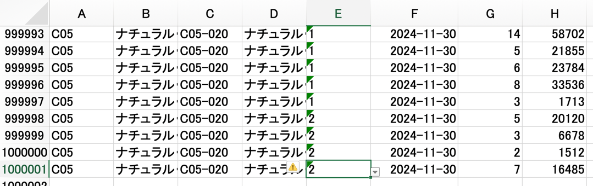

# csv2xlsx
### 概要
- pythonから起動して csv ファイル を Excel化する(Rust製)

### パフォーマンス計測
- 約10秒ほどで 300MBの csv を Excel(32MB) へコンバート。 

  - ```asm
    Converting sales_data_500k_with_kbn.csv to test.xlsx ...
    変換完了: 10.59 秒
    ```
